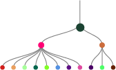
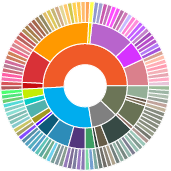
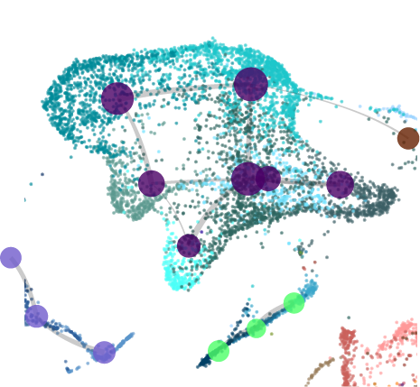

A collection of notebooks to recreate some of the visualizations as published in my [scientific papers](https://scholar.google.com/citations?user=No8cy_cAAAAJ&hl=en).

## Visualizations - hierarchy

[**HierTree**](HierTree.html): An example for plotting a hierarchical tree (not dendrogram!) based on result from hierarchical clustering.



```{r echo = F, eval= F, out.width = "50%", fig.align = "center"}
knitr::include_graphics("images/fig31_adjust_nodes.png")
```

<br> <br>

[**Sunburst**](Sunburst.html): 



<br> <br>


## Visualizations - sc/snRNA-seq

[**UMAP-Constellation**](UCon.html): Creating a UMAP and constellation from small single cell RNA-seq dataset




<br> <br>

[**3D UMAP**](3dUMAP.html): Creating a 3D UMAP from small single cell RNA-seq dataset

<br> <br>

[**Node dodge app **](Node_dodge.html): Creating a 3D UMAP from small single cell RNA-seq dataset

<br> <br>

## Visualizations - spatialTX

[**SpatialTx with CCF outlines**](MERFISH_plot.html): 

<br> <br>

[**3D SpatialTx**](3dMERFISH_plot.html): 

<br> <br>

## Visualizations - CCF

[**Flatmaps**](Flatmap.html): 

<br> <br>

[**ABA - ISH**](abaISH.html): 

<br> <br>

[**ABA - svg**](abaSVG.html): 

<br> <br>

## Visualizations - random
